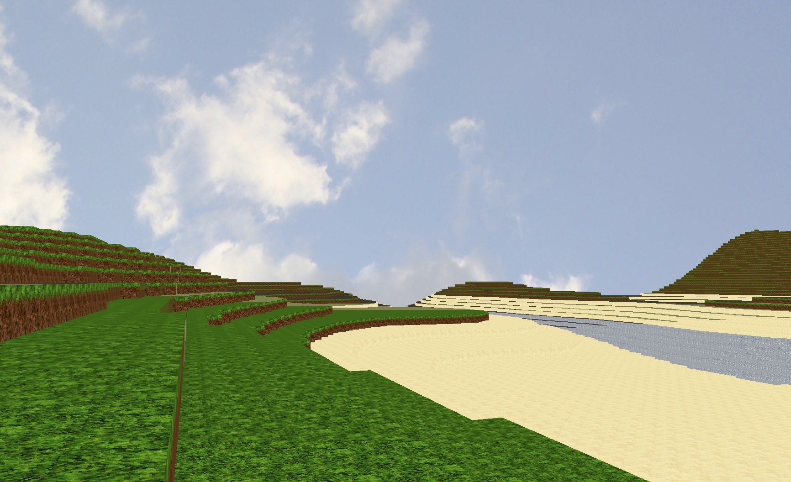

# A Minecraft Clone in OpenTK and C#

# How to Run

1. Visual Studio
	
	* Open Solution (.sln), F5.

2. MonoDevelop

	* Go to MonoDevelop.com and follow the steps to install it. 

	* The package manager in MonoDevelop should detect the correct OpenTK packages. The newest versions of OpenTK aren't compatible, probably due to .NET version. I selected v3.1.

3. VSCode + OmniSharp
	
	* This is for OmniSharp. There is also an extension that lets you debug with Mono on a server. 

	* Install Mono
	  sudo apt install mono-complete

	* Install steps for .NET runtime
	https://docs.microsoft.com/en-us/dotnet/core/install/linux-ubuntu#2110-

	* I had to enable Omnisharp:UseGlobalMono = True to get this to work.

	* There is also a solution explorer extension for VSCode that makes this easier.

4. Manual Debug with Mono

	* Install mono-complete.

	* Install .net runtime https://docs.microsoft.com/en-us/dotnet/core/install/linux-ubuntu#2110-

	* After installing you should be able to compile just by typing msbuild in the project (.sln) directory.

	* You can debug the .exe with mono using mono --debug myexe.exe

